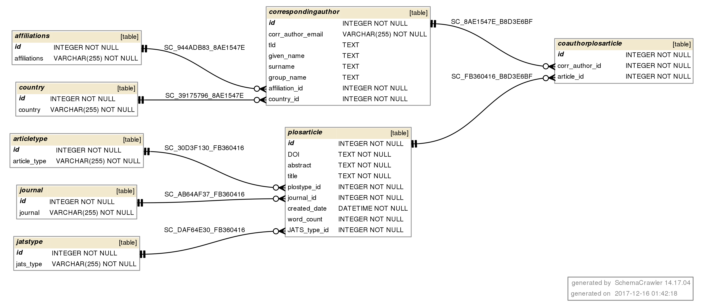

# Summary

All of Plos (allofplos) is a collection of Python scripts that can be used to download, keep up-to-date, and analyze the entire PLOS Corpus of over 220,000 scientific articles.
PLOS (the Public Library of Science) is a nonprofit open access science publisher, with a library of open access journals and other scientific literature under an open content license [@OpenContent]. As the volume of published literature grows, Text and Data Mining (TDM) is an increasingly important research methodology that allows insights derived from automated analysis of text and data.
With the PLOS corpus, researchers will be able to do Text and Data Mining (TDM) since all the articles are in machine readable JATS-standard XML files [@JATS]. These files have all article content with the exception of figures and supplemental data.

# Program description

The main script is plos_corpus.py, which downloads the whole PLOS Corpus as a zip of about 5 gigabytes file containing more than 220,000 xml files (about 20 gigabytes of disk space when uncompressed). After uncompressing the files, it queries the list of DOIs from the PLOS Search API [PLOSAPI] and compares it against the DOIs of local xml files. This creates a list of DOIs to download.  For each DOI in the list, its corresponding XML file is downloaded from the PLOS article page or from the internal ‘content-repo’ if executed from within PLOS network. It checks for amended articles (corrections, retractions, and expressions of concern) and uncorrected proofs. If any of those articles have a different remote XML version than the local file, it will download them and merge all into the main XML folder.
If the user wants to start analysing the corpus without doing the previous step, the project includes a starter_corpus directory, as seed data, a subset of 131 manually selected XML articles.
The main class to deal with PLOS articles is the Article class located in article_class.py. It provides access to most article metadata via its properties.

As an example of what can be done with this data, can be found in the corpus_analysis.py file in the samples directory. It is a set of functions to analyze articles in the PLOS corpus. A Jupyter Notebook [JUPYTER] is provided with examples such as spot check JATS field for irregularities, generate a list of retracted or corrected articles, create summaries of articles by type, publication date and more.

# Plos Corpus as a SQL Database

The project includes a ready to use SQLite [sqlite] Database with the seed data and a script to generate a custom database (makedb.py). With this script the user can generate a database out of the whole PLOS Corpus or a random subset with any given amount of articles. The database includes most article metadata and the abstract. This way the corpus can be searched with any standard SQL query. As an alternative to SQL, an Object Relational Mapper (ORM) based search is provided in dbtoorm.py.

# Data Availability

PLOS participates in industry efforts to further facilitate TDM research, including the construction of The Hague Declaration on Knowledge Discovery in the Digital Age. [haguedeclaration].
All articles published by PLOS are licencsed with the Creative Commons Attribution (CC BY) license. Under this license, authors retain ownership of the copyright for their content, but they allow anyone to download, reuse, reprint, modify, distribute and/or copy the content as long as the original authors and source are cited.

# References
